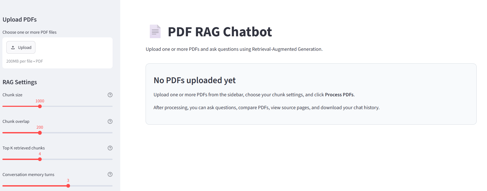
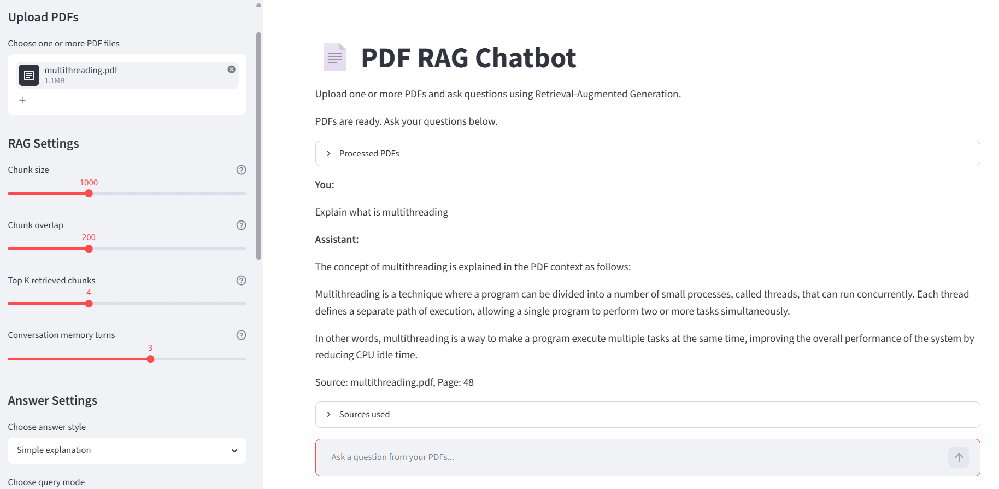
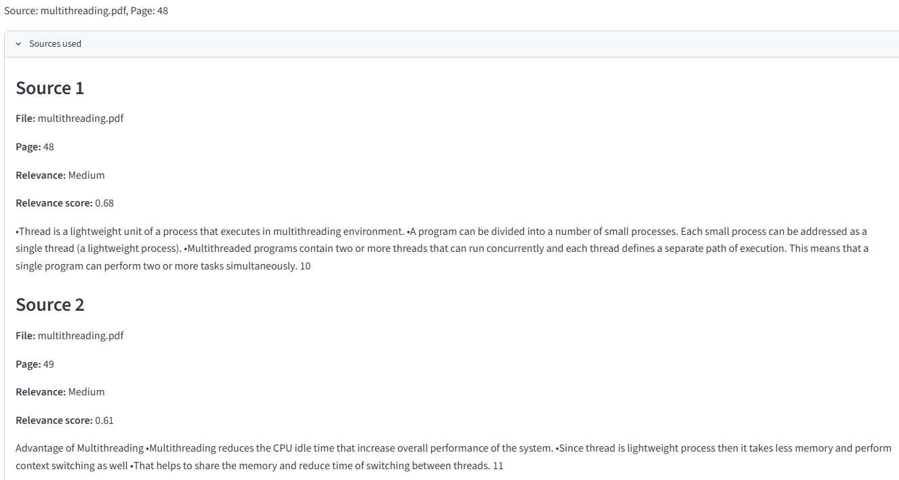

# 📄 PDF RAG Chatbot

## Overview

A RAG chatbot that lets you upload PDFs and ask questions from their content. Unlike chatbots that send your entire document to an LLM, this project chunks, embeds, and stores PDFs in a vector database - retrieving only the most relevant context per question. Every answer includes the source file name, page number, and relevance score.

Built with LangChain, ChromaDB, HuggingFace embeddings, Groq LLM, Streamlit, and Docker. Deployed on Hugging Face Spaces.

---

## Main Features

**Core RAG**
- Upload one or more PDFs
- Page-wise text extraction with metadata
- Adjustable chunk size and overlap
- Embeddings via `all-MiniLM-L6-v2`
- ChromaDB vector storage with session isolation
- Semantic similarity search with relevance scoring

**Chat**
- Conversation memory for follow-up questions
- 4 answer styles - Simple, Exam notes, Detailed, Bullet points
- Multi-PDF comparison mode
- Sample questions for quick testing
- Download chat history as `.txt`
- Clear chat or reset vector DB anytime
- Reduces hallucination by answering only from the uploaded PDF context. If the topic is not found, the chatbot clearly states that it is not mentioned in the uploaded PDFs.


**Sources**
- Source PDF name + page number on every answer
- Relevance label per chunk - High / Medium / Low
- Numeric relevance score displayed

---

## Tech Stack

| Purpose          | Technology                         |
| ---------------- | ---------------------------------- |
| User Interface   | Streamlit                          |
| RAG Framework    | LangChain                          |
| PDF Loading      | PyPDFLoader                        |
| Embeddings       | Hugging Face sentence-transformers |
| Embedding Model  | all-MiniLM-L6-v2                   |
| Vector Database  | ChromaDB                           |
| LLM              | Groq                               |
| Deployment       | Hugging Face Spaces                |
| Containerization | Docker                             |

---

## How the Chatbot Works

PDFs are loaded with `PyPDFLoader`, extracted page by page, and split into chunks using `RecursiveCharacterTextSplitter`. Each chunk is embedded via HuggingFace sentence-transformers and stored in ChromaDB with its source file name and page number.
On each question, ChromaDB runs a similarity search and retrieves the most relevant chunks. These are combined with the question, conversation history, answer style, and query mode into a prompt sent to Groq LLM - which answers only from the retrieved context, never from outside knowledge.
Every answer includes the source PDF name, page number, relevance label, and relevance score.

```
Upload PDFs
  → Extract text (page-wise, with file name + page number)
  → Split into chunks (adjustable size and overlap)
  → Generate embeddings (HuggingFace sentence-transformers)
  → Store in ChromaDB

User question + answer style + query mode + conversation memory
  → Similarity search → Top-K chunks retrieved
  → Prompt construction (chunks + history + style + mode)
  → Groq LLM
  → Answer with source, page number, and relevance score
```

---

## RAG Pipeline

```text
PDF Upload
→ Text Extraction
→ Text Chunking
→ Embedding Generation
→ ChromaDB Vector Storage
→ User Question
→ Similarity Search
→ Relevant Chunk Retrieval
→ Prompt Construction
→ Groq LLM Response
→ Answer with Sources
```

---

## Advanced RAG Features

### Adjustable Chunk Size and Overlap

The app allows users to change the chunk size and chunk overlap before processing PDFs.

Chunk size controls how much text is stored in each chunk. Chunk overlap controls how much text is repeated between nearby chunks. These settings affect retrieval quality.

```text
Small chunks  → more precise retrieval, but less context
Large chunks  → more context, but possibly less focused retrieval
More overlap  → better continuity, but more duplicate text
```

### Top-K Retrieval Control

The user can control how many chunks are retrieved for each question.

```text
Lower top-k → fewer chunks, more focused context
Higher top-k → more chunks, more context, but possible noise
```

### Relevance Signal

The app displays a relevance signal for each retrieved source.

| Relevance Score | Label  |
| --------------- | ------ |
| 0.75 and above  | High   |
| 0.50 to 0.74    | Medium |
| Below 0.50      | Low    |

This relevance score represents how closely a retrieved chunk matches the user question. It is a vector search relevance signal, not the LLM's confidence score.

### Conversation Memory

The chatbot uses recent conversation history to understand follow-up questions.

Example:

```text
User: What is inheritance?
Assistant: Inheritance is explained from the uploaded PDF.

User: Explain it in exam notes.
Assistant: The chatbot understands that "it" refers to inheritance.
```

This makes the app behave more like a real chatbot instead of a simple one-question-at-a-time PDF search tool.

### Multi-PDF Comparison Mode

The app includes a dedicated query mode called:

```text
Compare PDFs / Find mentions
```

This mode is useful when multiple PDFs are uploaded. It helps answer questions like:

```text
Which PDF mentions inheritance?
Which PDF explains normalization better?
Compare the uploaded PDFs on this topic.
```

The app retrieves relevant chunks from all uploaded PDFs and answers with file names, page numbers, and differences when available.

### Chat History Download

The app allows users to download their conversation as a text file. This is useful for saving notes, summaries, or exam preparation answers generated from the uploaded PDFs.

## Answer Style Options

The chatbot supports multiple answer styles:

* Simple explanation
* Exam notes
* Detailed answer
* Bullet points

This makes the app useful for different types of users. For example, students can use Exam notes mode for quick revision, while Detailed answer mode can be used for deeper understanding.

---

## Project Structure

```text
PDF-RAG-Chatbot/
│
├── app.py
├── requirements.txt
├── Dockerfile
├── README.md
├── .gitignore
└── .env (ignored here)
```

---

## Environment Variables

Create a `.env` file in the project root for local development:

```env
GROQ_API_KEY=your_groq_api_key_here
```

For Hugging Face Spaces deployment, add the same key as a secret:

```text
Name  : GROQ_API_KEY
Value : your_actual_groq_api_key
```

Do not hardcode the API key inside `app.py`.

## Local Setup

Clone the repository:

```bash
git clone
cd PDF-RAG-Chatbot
```

Create a virtual environment:

```bash
python -m venv venv
```

Activate the virtual environment on Windows:

```bash
venv\Scripts\activate
```

Activate the virtual environment on macOS/Linux:

```bash
source venv/bin/activate
```

Install dependencies:

```bash
pip install -r requirements.txt
```

Create a `.env` file and add your Groq API key:

```env
GROQ_API_KEY=your_groq_api_key_here
```

Run the app:

```bash
streamlit run app.py
```

## Docker Setup

Build the Docker image:

```bash
docker build -t pdf-rag-chatbot .
```

Run the Docker container:

```bash
docker run -p 8501:8501 --env-file .env pdf-rag-chatbot
```

## Hugging Face Spaces Deployment

The app is deployed on Hugging Face Spaces using Docker.

Required files:

```text
app.py
requirements.txt
Dockerfile
README.md
.gitignore
```

Add the Groq API key in Hugging Face Spaces:

```text
Settings → Variables and secrets → New secret
```

Use:

```text
GROQ_API_KEY = your_actual_groq_key
```

---

## Sample Questions

```text
Summarize the uploaded PDF.
What are the main topics covered?
Explain this in simple words.
Give important exam points.
Create short notes from this PDF.
Which PDF mentions the main topic?
Compare the uploaded PDFs on this topic.
```

---

## Screenshots

The app starts with a clean empty state that guides users to upload and process their PDFs.


This is sample chat answer from uploaded PDF.


These are the Sources used for particular chat answer.


---

## Known Limitations

* Works best with text-based PDFs.
* Scanned PDFs may require OCR.
* Very large PDFs may take longer to process.
* Retrieval quality depends on chunk size, overlap, and PDF text quality.
* Relevance scores show retrieval similarity, not final answer certainty.
* The model answers only from retrieved chunks, so missed retrieval can affect the response.
  
---

## Future Improvements

* Add OCR support for scanned PDFs
* Support DOCX and TXT files
* Add user authentication
* Add persistent document storage
* Add highlighted PDF citations
* Add retrieval evaluation metrics
* Add better citation formatting

---

## License

This project is open-source and available under the MIT License.
